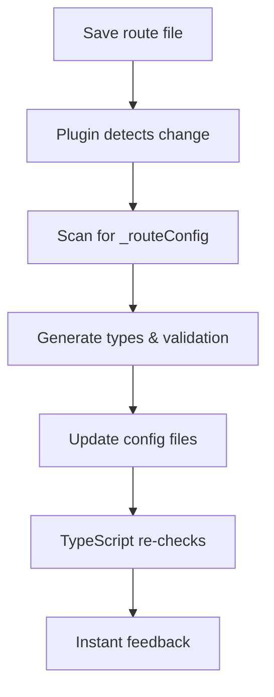

# skRoutes

A TypeScript-first SvelteKit library for type-safe URL generation and route parameter validation using Standard Schema.

## Table of Contents

- [Installation](#installation)
- [Features](#features)
- [Quick Start](#quick-start)
  - [Vite Plugin Setup (Recommended)](#4-vite-plugin-for-auto-generated-routes-recommended)
  - [Manual Configuration](#manual-configuration)
- [Advanced Usage](#advanced-usage)
- [Vite Plugin Architecture](#vite-plugin-architecture)
- [API Reference](#api-reference)  
- [Migration Guide](#migration-guide)
- [Contributing](#contributing)

## Installation

```bash
npm install skroutes
# or
pnpm add skroutes
```

## Features

### 🚀 **Auto-Generation & Zero Config**
- 🔄 **Vite Plugin Integration**: Automatically discovers routes from your SvelteKit file structure
- 🎯 **Zero Manual Configuration**: No need to manually register routes - just add `_routeConfig` exports
- ⚡ **Hot Reload**: Instant type updates when you modify route files
- 🏗️ **Smart Type Generation**: Generates precise TypeScript types from your validation schemas
- 🌍 **Dual Config System**: Optimized client/server configurations for different environments

### 🔒 **Type Safety & Validation**
- 🏷️ **Standard Schema Support**: Works with Zod, Valibot, ArkType, and any Standard Schema-compliant library  
- 📝 **Type-safe URL generation** with automatic validation and proper return types
- 🚦 **Compile-time Route Validation**: TypeScript catches invalid routes and parameter types
- 🎯 **Parameter Strategy System**: Flexible handling of unconfigured routes (`allowAll`, `never`, `simple`, `strict`)
- 🎯 **Non-Optional Results**: `params` and `searchParams` are never undefined - no optional chaining needed

### 🎨 **Reactive State Management**
- 🛠️ **Easy URL manipulation** with strongly typed parameter updates  
- 🔄 **Bi-directional synchronization**: Changes flow seamlessly between URL state and component state
- ⚡ **Throttled updates**: Built-in throttling prevents excessive URL changes during rapid state updates
- 🎯 **Direct binding**: Bind form inputs directly to URL parameters with automatic synchronization
- 💾 **Unsaved changes detection**: Track when internal state differs from URL state
- 🔄 **Reset functionality**: Easily revert changes back to the current URL state

### 🛠️ **Developer Experience**
- 🎨 **Svelte 5 Runes Support**: Full compatibility with modern Svelte reactive patterns
- 📊 **Debug mode**: Comprehensive logging to understand state synchronization flow
- 🔧 **Flexible Configuration**: Extensive plugin options for customization
- 📁 **Clean File Organization**: Co-locate validation with route logic

## Quick Start

### 1. Define Your Route Configuration

```typescript
// src/lib/routes.ts
import { skRoutes } from 'skroutes';
import { z } from 'zod';

export const { urlGenerator, pageInfo } = skRoutes({
	config: {
		'/users/[id]': {
			paramsValidation: z.object({
				id: z.string().uuid()
			}),
			searchParamsValidation: z.object({
				tab: z.enum(['profile', 'settings']).optional(),
				page: z.coerce.number().positive().optional()
			})
		},
		'/products/[slug]': {
			paramsValidation: z.object({
				slug: z.string().min(1)
			})
		}
	},
	errorURL: '/error'
});
```

### 2. Generate Type-Safe URLs

```typescript
import { urlGenerator } from '$lib/routes';

// Generate a URL with validation - all parameters are strongly typed!
const userUrl = urlGenerator({
	address: '/users/[id]', // ✅ TypeScript validates this route exists
	paramsValue: { id: 'user123' }, // ✅ TypeScript knows id: string is required
	searchParamsValue: { tab: 'profile', page: 1 } // ✅ TypeScript validates tab and page types
});

console.log(userUrl.url); // '/users/user123?tab=profile&page=1'
console.log(userUrl.error); // false
console.log(userUrl.params); // ✅ Typed as { id: string } (never undefined!)
console.log(userUrl.searchParams); // ✅ Typed as { tab: 'profile' | 'settings' | undefined, page: number | undefined } (never undefined!)

// No need for optional chaining - params and searchParams are guaranteed to exist
const userId = userUrl.params.id; // ✅ Direct access, no userUrl.params?.id needed
const userTab = userUrl.searchParams.tab; // ✅ Direct access, no userUrl.searchParams?.tab needed

// ❌ TypeScript will catch these errors at compile time:
// urlGenerator({ address: '/nonexistent' }); // Error: route doesn't exist
// urlGenerator({ address: '/users/[id]', paramsValue: { id: 123 } }); // Error: id must be string
// urlGenerator({ address: '/users/[id]', searchParamsValue: { tab: 'invalid' } }); // Error: invalid tab value
```

### 3. Use in SvelteKit Pages

```svelte
<!-- src/routes/users/[id]/+page.svelte -->
<script lang="ts">
	import { pageInfo } from '$lib/routes';
	import { page } from '$app/state';

	export let data; // From your +page.server.ts

	// Create reactive route info with throttled URL updates
	const route = pageInfo('/users/[id]', () => $page, {
		updateDelay: 500, // 500ms throttling
		onUpdate: (url) => console.log('URL updated:', url),
		debug: false // Enable for debugging
	});

	const tabs = ['profile', 'settings'] as const;

	// Function to switch tabs
	function switchTab(tab: string) {
		route.updateParams({ searchParams: { tab } });
	}

	// You can also bind directly to form inputs
	let searchQuery = $state('');
	
	// Bind to route parameters for reactive URL updates
	$effect(() => {
		if (searchQuery) {
			route.current.searchParams = { 
				...route.current.searchParams, 
				query: searchQuery 
			};
		}
	});
</script>

<div class="page">
	<h1>User: {route.current.params.id}</h1>
	<p>Current Tab: {route.current.searchParams.tab || 'profile'}</p>

	<!-- Show unsaved changes indicator -->
	{#if route.hasChanges}
		<div class="unsaved-changes">
			<p>You have unsaved changes</p>
			<button onclick={route.resetParams}>Reset</button>
		</div>
	{/if}

	<!-- Direct binding to search parameters -->
	<input 
		type="text" 
		bind:value={route.current.searchParams.query}
		placeholder="Search..."
	/>

	<div class="tabs">
		{#each tabs as tab}
			<button 
				onclick={() => switchTab(tab)} 
				class:active={route.current.searchParams.tab === tab}
			>
				{tab}
			</button>
		{/each}
	</div>
</div>
```

### 4. Vite Plugin for Auto-Generated Routes (Recommended)

**The Vite plugin is the recommended approach** for using skRoutes. It automatically scans your SvelteKit route files and generates fully-typed configurations with zero manual setup.

#### Plugin Setup

```typescript
// vite.config.ts
import { sveltekit } from '@sveltejs/kit/vite';
import { defineConfig } from 'vite';
import { skRoutesPlugin } from 'skroutes/plugin';

export default defineConfig({
	plugins: [
		sveltekit(),
		skRoutesPlugin({
			// Required: URL to redirect to when validation fails
			errorURL: '/error',
			
			// Optional: Additional imports for your validation schemas
			imports: ["import { z } from 'zod';"],
			
			// Optional: How to handle routes without explicit validation
			unconfiguredParams: 'allowAll', // 'allowAll' | 'never' | 'simple' | 'strict'
			unconfiguredSearchParams: 'allowAll',
			
			// Optional: Custom paths for generated files
			clientOutputPath: 'src/lib/.generated/skroutes-client-config.ts',
			serverOutputPath: 'src/lib/.generated/skroutes-server-config.ts',
			
			// Optional: Include server-side files in scanning
			includeServerFiles: true,
			
			// Optional: Manual route configs to include
			baseConfig: {
				'/api/health': { 
					paramsValidation: undefined, 
					searchParamsValidation: undefined 
				}
			}
		})
	]
});
```

#### Configure Route Validation

Add validation to your route files using `_routeConfig`:

```typescript
// src/routes/users/[id]/+page.ts
import { z } from 'zod';

// Export validation configuration
export const _routeConfig = {
	paramsValidation: z.object({
		id: z.string().uuid()
	}).parse,
	searchParamsValidation: z.object({
		tab: z.enum(['profile', 'settings']).optional(),
		page: z.coerce.number().positive().optional()
	}).parse
};

// Your normal load function
export async function load({ params, url }) {
	// params.id is automatically validated as UUID
	// url.searchParams are automatically validated
	return {
		user: await fetchUser(params.id)
	};
}
```

```typescript
// src/routes/products/[category]/+page.server.ts
import { z } from 'zod';

export const _routeConfig = {
	paramsValidation: z.object({
		category: z.enum(['electronics', 'clothing', 'books'])
	}).parse,
	searchParamsValidation: z.object({
		sort: z.enum(['price', 'name', 'rating']).optional(),
		minPrice: z.coerce.number().min(0).optional(),
		maxPrice: z.coerce.number().min(0).optional()
	}).parse
};

export async function load({ params, url }) {
	// Fully typed and validated parameters
	return {
		products: await fetchProducts(params.category, {
			sort: url.searchParams.get('sort'),
			minPrice: url.searchParams.get('minPrice'),
			maxPrice: url.searchParams.get('maxPrice')
		})
	};
}
```

#### Use Auto-Generated Routes

The plugin generates two configuration files:

```typescript
// Import the appropriate config for your environment
import { urlGenerator, pageInfo } from '$lib/.generated/skroutes-client-config'; // Client-side
// or
import { urlGenerator, pageInfo } from '$lib/.generated/skroutes-server-config'; // Server-side (has access to all routes)

// All your routes are automatically typed and available!
const userUrl = urlGenerator({
	address: '/users/[id]', // ✅ Auto-completed from your route files
	paramsValue: { id: 'user123' }, // ✅ TypeScript knows this must be a UUID
	searchParamsValue: { tab: 'profile' } // ✅ TypeScript validates enum values
});

// Perfect type inference for all discovered routes
const productUrl = urlGenerator({
	address: '/products/[category]',
	paramsValue: { category: 'electronics' }, // ✅ Only allows valid enum values
	searchParamsValue: { sort: 'price', minPrice: 50 }
});
```

#### Parameter Handling Strategies

The plugin provides flexible strategies for handling routes without explicit validation:

```typescript
skRoutesPlugin({
	// Strategy for route parameters [id], [slug], etc.
	unconfiguredParams: 'never', // No parameters allowed
	// unconfiguredParams: 'allowAll', // Accept any string parameters
	// unconfiguredParams: 'simple', // Optional string parameters
	// unconfiguredParams: 'strict', // Compile-time error (prevents usage)
	
	// Strategy for search parameters ?page=1&sort=name
	unconfiguredSearchParams: 'simple', // Optional string/array parameters  
	// unconfiguredSearchParams: 'never', // No search parameters allowed
	// unconfiguredSearchParams: 'allowAll', // Accept any search parameters
	// unconfiguredSearchParams: 'strict', // Compile-time error (prevents usage)
	
	errorURL: '/error'
});
```

**Strategy Examples:**

- **`'never'`**: Routes generate `{}` types - no unconfigured parameters allowed
- **`'allowAll'`**: Routes generate `Record<string, string>` - accepts any parameters  
- **`'simple'`**: Routes generate `{ [key: string]?: string }` - optional parameters
- **`'strict'`**: Routes generate `never` - TypeScript prevents usage entirely

#### Hot Reload & Development

The plugin automatically watches your route files and regenerates configurations when:
- You add/remove route files
- You modify `_routeConfig` exports
- You change validation schemas

This provides seamless development experience with instant TypeScript feedback.

## Advanced Usage

### Throttled Synchronization

skRoutes uses a sophisticated bi-directional synchronization system that keeps URL state and component state in perfect sync:

```typescript
const route = pageInfo('/search', () => $page, {
	updateDelay: 300, // Throttle URL updates to 300ms
	debug: true // See synchronization in action
});

// Changes to internal state are throttled before updating the URL
route.current.searchParams.query = 'hello';
route.current.searchParams.filter = 'active';
// ↑ Both changes are batched and applied after 300ms

// External URL changes (like browser navigation) immediately sync to internal state
// No throttling on incoming changes - only outgoing URL updates are throttled
```

**Key Benefits:**

- **Smooth UX**: Rapid typing in search boxes doesn't create browser history spam
- **Batched Updates**: Multiple parameter changes are combined into single URL updates  
- **Instant Sync**: External navigation immediately updates component state
- **Change Detection**: Only real content changes trigger updates (not just object reference changes)

### Direct Binding Patterns

```svelte
<script>
	const route = pageInfo('/products', () => $page, {
		updateDelay: 500,
		debug: false
	});
	
	// Complex form state that syncs to URL
	let formData = $state({
		search: route.current.searchParams.search || '',
		category: route.current.searchParams.category || 'all',
		priceRange: [
			Number(route.current.searchParams.minPrice) || 0,
			Number(route.current.searchParams.maxPrice) || 1000
		]
	});
	
	// Sync form changes back to URL (throttled)
	$effect(() => {
		route.current.searchParams = {
			search: formData.search || undefined,
			category: formData.category !== 'all' ? formData.category : undefined,
			minPrice: formData.priceRange[0] !== 0 ? formData.priceRange[0].toString() : undefined,
			maxPrice: formData.priceRange[1] !== 1000 ? formData.priceRange[1].toString() : undefined
		};
	});
</script>

<!-- Form inputs automatically stay in sync with URL -->
<input bind:value={formData.search} placeholder="Search products..." />
<select bind:value={formData.category}>
	<option value="all">All Categories</option>
	<option value="electronics">Electronics</option>
	<option value="clothing">Clothing</option>
</select>

<!-- Show unsaved changes -->
{#if route.hasChanges}
	<div class="changes-indicator">
		<span>Unsaved filters</span>
		<button onclick={route.resetParams}>Reset</button>
	</div>
{/if}
```

### Manual Configuration

You can also manually configure routes without the plugin:

```typescript
// src/lib/routes.ts
import { skRoutes } from 'skroutes';
import { z } from 'zod';

export const { urlGenerator, pageInfo } = skRoutes({
	config: {
		'/users/[id]': {
			paramsValidation: z.object({ id: z.string().uuid() }),
			searchParamsValidation: z.object({
				tab: z.enum(['profile', 'settings']).optional(),
				search: z.string().optional(),
				page: z.coerce.number().positive().optional()
			})
		},
		'/products/[category]': {
			paramsValidation: z.object({ 
				category: z.enum(['electronics', 'clothing', 'books'])
			}),
			searchParamsValidation: z.object({
				sort: z.enum(['price', 'name', 'rating']).optional(),
				minPrice: z.coerce.number().min(0).optional(),
				maxPrice: z.coerce.number().min(0).optional()
			})
		}
	},
	errorURL: '/error',
	updateAction: 'goto' // Default behavior for all pageInfo instances
});
```

### Error Handling

When validation fails, skRoutes redirects to your configured `errorURL`:

```typescript
const result = urlGenerator({
	address: '/users/[id]',
	paramsValue: { id: 'invalid-uuid' }
});

if (result.error) {
	console.log(result.url); // '/error?message=Error+generating+URL'
}
```

### Standard Schema Support

Works with any Standard Schema-compliant validation library:

```typescript
// Zod
import { z } from 'zod';
const zodSchema = z.object({ id: z.string() });

// Valibot
import * as v from 'valibot';
const valibotSchema = v.object({ id: v.string() });

// ArkType
import { type } from 'arktype';
const arkSchema = type({ id: 'string' });

// Use any of these in your route config
export const routes = skRoutes({
	config: {
		'/users/[id]': {
			paramsValidation: zodSchema // or valibotSchema, or arkSchema
		}
	},
	errorURL: '/error'
});
```

## Vite Plugin Architecture

### How the Plugin Works

The skRoutes Vite plugin provides a sophisticated auto-generation system that eliminates manual configuration:

#### 1. **Route Discovery**
```
src/routes/
├── +page.ts                    → '/' route
├── users/[id]/
│   ├── +page.ts               → '/users/[id]' route  
│   └── +page.server.ts        → '/users/[id]' server config
├── products/[category]/
│   ├── +page.svelte          → '/products/[category]' route
│   └── +server.ts            → '/products/[category]' API endpoint
└── api/health/
    └── +server.ts            → '/api/health' API route
```

The plugin automatically scans your `src/routes` directory and discovers:
- Page routes (`+page.ts`, `+page.svelte`) 
- Server routes (`+page.server.ts`, `+server.ts`)
- API endpoints (`+server.ts`)
- Route parameters from directory structure (`[id]`, `[[slug]]`)

#### 2. **Configuration Detection**

The plugin looks for `_routeConfig` exports in your route files:

```typescript
// Detected automatically ✅
export const _routeConfig = {
	paramsValidation: z.object({ id: z.string() }).parse,
	searchParamsValidation: z.object({ tab: z.string().optional() }).parse
};

// Also detects partial configs ✅
export const _routeConfig = {
	paramsValidation: z.object({ id: z.string() }).parse
	// searchParamsValidation will use the configured strategy
};

// Routes without _routeConfig use configured strategies ✅
```

#### 3. **Smart Type Generation**

For each route, the plugin generates appropriate types based on:

**Explicit Configuration**: Uses your validation schemas for precise typing
```typescript
// Your schema
z.object({ id: z.string().uuid() })

// Generated type  
{ id: string } // with UUID validation at runtime
```

**Route Parameters**: Automatically detects from file structure
```typescript
// File: src/routes/posts/[slug]/comments/[id]/+page.ts
// Generated type
{ slug: string; id: string }

// File: src/routes/blog/[[year]]/+page.ts  
// Generated type
{ year?: string } // Optional parameter
```

**Configured Strategies**: Uses your strategy for unconfigured routes
```typescript
// Strategy: 'never'
// Generated type for routes without _routeConfig
{ params: {}; searchParams: {} }

// Strategy: 'allowAll' 
// Generated type for routes without _routeConfig
{ params: Record<string, string>; searchParams: Record<string, unknown> }
```

#### 4. **Dual Configuration Generation**

The plugin generates two optimized configuration files:

**Client Config** (`skroutes-client-config.ts`):
- Safe for browser environments
- Only imports from client-side files (`+page.ts`)
- Type-only imports for server schemas (for better inference)
- Smaller bundle size

**Server Config** (`skroutes-server-config.ts`):  
- Full access to all routes
- Imports from both client and server files
- Complete validation coverage
- Used for server-side rendering

#### 5. **Development Workflow**



**Hot Reload**: Changes are detected instantly and configs are regenerated
**Type Safety**: Immediate TypeScript feedback in your editor
**Zero Config**: No manual route registration needed

### Plugin Configuration Reference

```typescript
interface PluginOptions {
	/** URL to redirect to when validation fails */
	errorURL: string;
	
	/** Path for server-side config file */
	serverOutputPath?: string; // default: 'src/lib/.generated/skroutes-server-config.ts'
	
	/** Path for client-side config file */ 
	clientOutputPath?: string; // default: 'src/lib/.generated/skroutes-client-config.ts'
	
	/** Additional import statements for generated files */
	imports?: string[]; // default: []
	
	/** Include server files (+page.server.ts, +server.ts) in scanning */
	includeServerFiles?: boolean; // default: true
	
	/** Manual route configurations to include */
	baseConfig?: Record<string, any>; // default: {}
	
	/** Strategy for handling unconfigured route parameters */
	unconfiguredParams?: 'allowAll' | 'never' | 'simple' | 'strict'; // default: 'allowAll'
	
	/** Strategy for handling unconfigured search parameters */
	unconfiguredSearchParams?: 'allowAll' | 'never' | 'simple' | 'strict'; // default: 'allowAll'
}
```

### Best Practices

#### 1. **Strategy Selection**
```typescript
// For new projects - strict validation
unconfiguredParams: 'strict',        // Prevents accidental usage
unconfiguredSearchParams: 'never',   // Forces explicit configuration

// For existing projects - gradual adoption  
unconfiguredParams: 'simple',        // Allows migration
unconfiguredSearchParams: 'simple',  // Optional parameters

// For maximum flexibility
unconfiguredParams: 'allowAll',      // Accepts any parameters
unconfiguredSearchParams: 'allowAll' // Accepts any search params
```

#### 2. **File Organization**
```typescript
// ✅ Keep validation schemas close to usage
// src/routes/users/[id]/+page.ts
import { userSchema } from './schemas'; // Local schema file

export const _routeConfig = {
	paramsValidation: userSchema.parse
};

// ✅ Reuse schemas across related routes  
// src/routes/users/[id]/edit/+page.ts
import { userSchema } from '../schemas'; // Shared parent schema
```

#### 3. **Import Strategy**
```typescript
// ✅ Import from client config for browser code
import { urlGenerator } from '$lib/.generated/skroutes-client-config';

// ✅ Import from server config for SSR/API routes
import { urlGenerator } from '$lib/.generated/skroutes-server-config';

// ✅ Use conditional imports for universal code
const config = import.meta.env.SSR 
	? await import('$lib/.generated/skroutes-server-config')
	: await import('$lib/.generated/skroutes-client-config');
```

## API Reference

### `skRoutes(options)`

Creates a route configuration with type-safe utilities.

**Options:**

- `config`: Object mapping route patterns to validation schemas
- `errorURL`: URL to redirect to on validation errors

**Returns:**

- `urlGenerator`: Function to generate validated URLs
- `pageInfo`: Client-side route information utility with optional debounced updates

### Route Configuration

```typescript
interface RouteConfig {
	[routePattern: string]: {
		paramsValidation?: StandardSchemaV1<unknown, unknown>;
		searchParamsValidation?: StandardSchemaV1<unknown, unknown>;
	};
}
```

### URL Generator

```typescript
urlGenerator({
  address: '/users/[id]',           // Route pattern
  paramsValue?: { id: 'user123' },  // Route parameters
  searchParamsValue?: { tab: 'profile' } // Search parameters
})
```

**Returns:**

```typescript
{
	address: string;
	url: string;
	error: boolean;
	params: Record<string, unknown>; // Never undefined
	searchParams: Record<string, unknown>; // Never undefined
}
```

### Page Info

```typescript
pageInfo(
  routeId: '/users/[id]',           // Route pattern
  pageData: () => ({ params: {...}, url: {...} }), // Function returning SvelteKit page data
  config?: {                        // Optional configuration
    updateDelay?: 500,              // Throttle delay in milliseconds (default: 0)
    onUpdate?: (newUrl: string) => void, // Callback for URL changes
    updateAction?: 'goto' | 'nil',  // Whether to navigate or just update state
    debug?: boolean                 // Enable debug logging
  }
)
```

**Returns:**

```typescript
{
	current: {
		params: Record<string, unknown>; // Current validated params (reactive)
		searchParams: Record<string, unknown>; // Current validated search params (reactive)
	},
	updateParams: (updates: {
		params?: Partial<ParamsType>;
		searchParams?: Partial<SearchParamsType>;
	}) => UrlGeneratorResult,
	updateParamsURLGenerator: (updates) => UrlGeneratorResult, // Generate URL without navigation
	resetParams: () => void,          // Reset to current URL state
	hasChanges: boolean              // True if internal state differs from URL
}
```

## Migration Guide

### From Manual Configuration to Vite Plugin

**Recommended**: Migrate from manual configuration to the Vite plugin for better DX and maintainability.

#### Before (Manual Configuration)

```typescript
// src/lib/routes.ts - Manual maintenance required ❌
import { skRoutes } from 'skroutes';
import { z } from 'zod';

export const { urlGenerator, pageInfo } = skRoutes({
	config: {
		// Must manually add each route ❌
		'/users/[id]': {
			paramsValidation: z.object({ id: z.string().uuid() }).parse,
			searchParamsValidation: z.object({
				tab: z.enum(['profile', 'settings']).optional()
			}).parse
		},
		'/products/[category]': {
			paramsValidation: z.object({ 
				category: z.enum(['electronics', 'clothing', 'books'])
			}).parse
		}
		// Easy to forget routes, get out of sync ❌
	},
	errorURL: '/error'
});
```

#### After (Vite Plugin)

```typescript
// vite.config.ts - One-time setup ✅
export default defineConfig({
	plugins: [
		sveltekit(),
		skRoutesPlugin({
			errorURL: '/error',
			unconfiguredParams: 'never', // Strict validation
			unconfiguredSearchParams: 'simple'
		})
	]
});
```

```typescript
// src/routes/users/[id]/+page.ts - Validation alongside route logic ✅
export const _routeConfig = {
	paramsValidation: z.object({ id: z.string().uuid() }).parse,
	searchParamsValidation: z.object({
		tab: z.enum(['profile', 'settings']).optional()
	}).parse
};

export async function load({ params }) {
	// params.id is already validated as UUID ✅
	return { user: await getUser(params.id) };
}
```

```typescript
// src/routes/products/[category]/+page.ts - Automatic discovery ✅
export const _routeConfig = {
	paramsValidation: z.object({ 
		category: z.enum(['electronics', 'clothing', 'books'])
	}).parse
};

// Route automatically discovered and typed ✅
```

```typescript
// Usage stays the same ✅
import { urlGenerator } from '$lib/.generated/skroutes-client-config';

const url = urlGenerator({
	address: '/users/[id]',
	paramsValue: { id: 'user123' }
});
```

**Migration Benefits:**
- ✅ **Zero maintenance**: Routes auto-discovered from file system
- ✅ **Co-location**: Validation lives with route logic
- ✅ **Type safety**: Automatic TypeScript integration 
- ✅ **Hot reload**: Instant feedback during development
- ✅ **Server/client optimization**: Separate configs for different environments

### From Previous Versions

**Major Changes:**

1. **Function-based pageInfo**: `pageInfo` now takes a function that returns page data for better reactivity
2. **Configuration Object**: Parameters are now passed as a configuration object instead of positional arguments  
3. **Bi-directional Sync**: Direct binding to `current.params` and `current.searchParams` with automatic throttling
4. **New Utilities**: Added `resetParams()`, `hasChanges`, and `updateParamsURLGenerator()`
5. **Enhanced Debugging**: Comprehensive debug logging with the `debug` option

**Old Usage:**

```typescript
// Old way with positional arguments
const { current, updateParams } = pageInfo(
	routeId, 
	$page, 
	500, // delay
	goto // onUpdate callback
);
```

**New Usage:**

```typescript
// New way with function and configuration object
const route = pageInfo(routeId, () => $page, {
	updateDelay: 500,
	onUpdate: goto,
	updateAction: 'goto', // or 'nil' for state-only updates
	debug: true // Enable debugging
});

// New features available
console.log(route.hasChanges); // Check for unsaved changes
route.resetParams(); // Reset to URL state

// Direct binding now works with throttling
route.current.searchParams = { newValue: 'test' }; // Automatically throttled
```

**Enhanced Reactive Patterns:**

```typescript
// You can now bind directly to route parameters
<input bind:value={route.current.searchParams.query} />

// Or use reactive effects
$effect(() => {
	if (someCondition) {
		route.current.searchParams.filter = 'active';
	}
});

// Check for unsaved changes
{#if route.hasChanges}
	<button onclick={route.resetParams}>Reset Changes</button>
{/if}
```

## Contributing

Contributions are welcome! Please read our contributing guidelines and submit pull requests to our [GitHub repository](https://github.com/qwacko/skroutes).

## License

MIT License - see LICENSE file for details.
